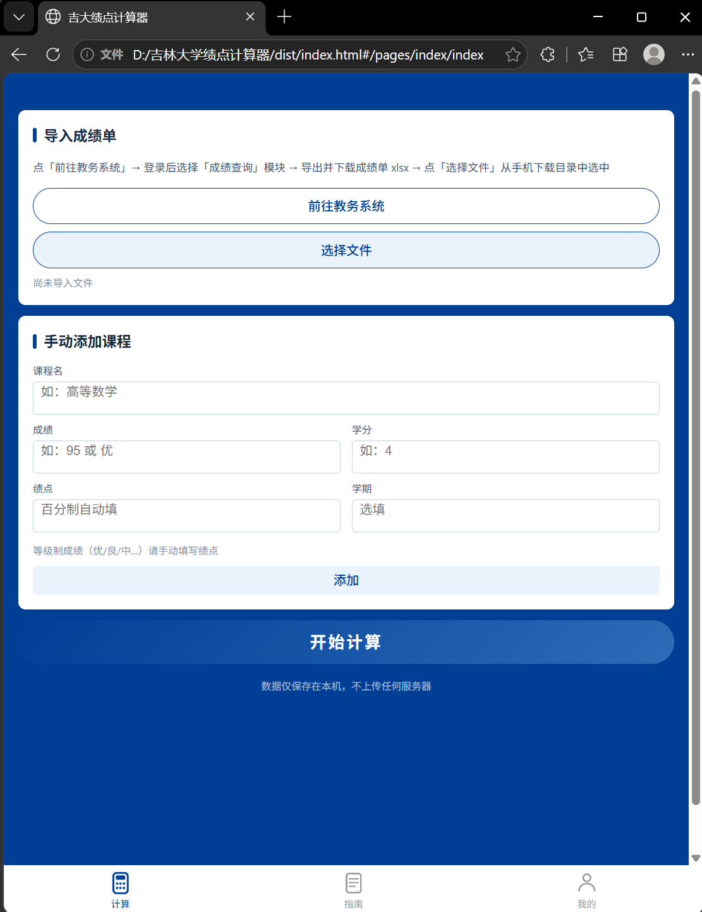
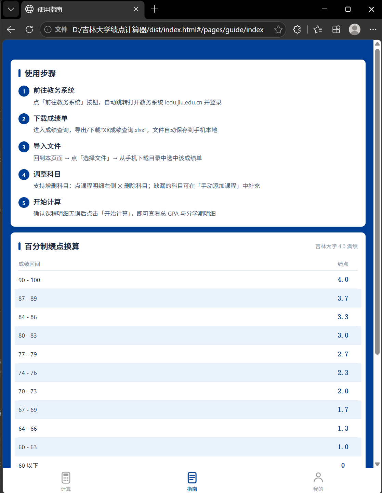
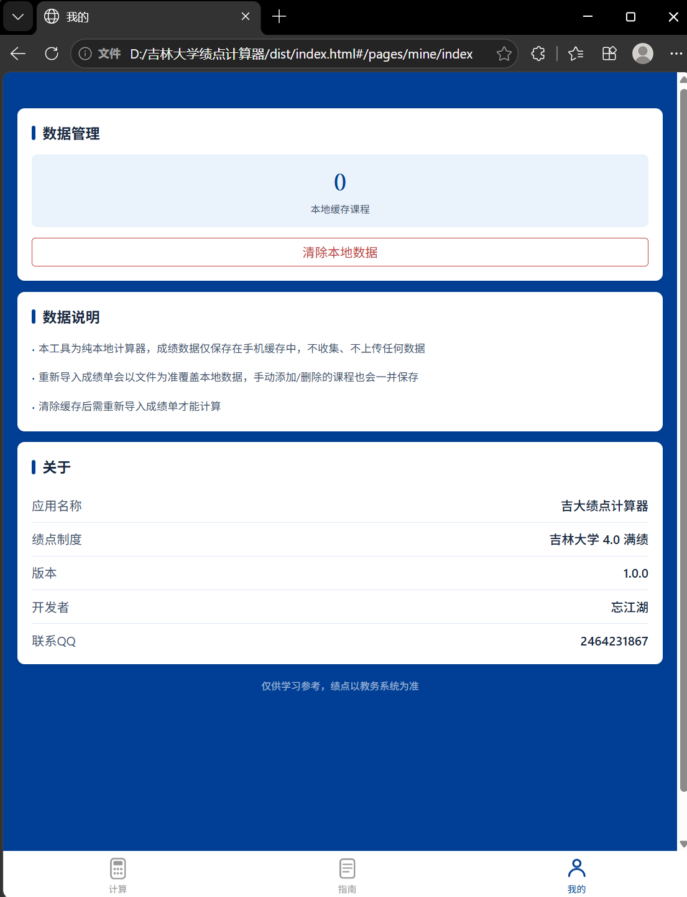

# JLU GPA Calculator

吉林大学绩点计算器，自己写着用的小工具。

导入教务系统导出的成绩单 Excel（`XX成绩查询.xlsx`），自动算加权平均分和绩点（4.0 满绩），也可以手动加课、删课，百分制成绩自动换算。纯前端本地计算，不上传任何数据。

一套代码（Taro + React），编译成微信小程序和网页两个版本。

## 截图

网页版（计算 / 指南 / 我的）：







小程序版：


## 怎么用

- 网页版：`npm run build:h5` 之后双击 `dist/h5/index.html` 就能用，不用起服务，也可以把 dist/h5 文件夹压缩发给别人
- 小程序版：`npm run build:weapp` 后用微信开发者工具导入项目根目录（`project.config.json` 不入库，复制 `project.config.json.example` 改个名，填上自己的 AppID）
- 导入的文件必须是教务系统「成绩查询」导出的 `XX成绩查询.xlsx`，表头（21 列）别动，改了会识别不出来

## 本地运行

```
git clone https://github.com/Augenstern-W/JLU-GPA-calculator.git
cd JLU-GPA-calculator
npm install
```

```
npm run dev:h5       # 网页版开发预览
npm run build:h5     # 网页版构建 -> dist/h5
npm run build:weapp  # 小程序构建 -> dist/weapp
```

## 结构

```
src/pages     三个页面：计算 / 指南 / 我的
src/utils     绩点计算、文件导入、本地存储
src/styles    主题变量（吉大蓝 #003F95）
config        Taro 构建配置
```

计算结果仅供参考，以教务系统为准。

忘江湖 2464231867@qq.com